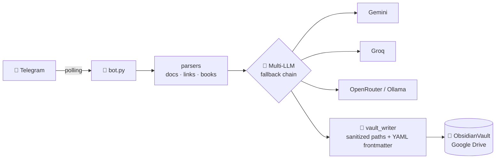

<div align="center">


> **Turn Telegram into your personal knowledge capture pipeline.** Send documents, links, and e-books to a bot — get clean, AI-categorized Markdown notes in your Obsidian vault, synced across all your devices.

[](LICENSE)
[](https://github.com/filmfer/TelegramObsidian/releases)
[](https://www.python.org/)
[](https://www.docker.com/)
[](https://telegram.org/)
[](https://obsidian.md/)
[](#-multi-provider--free)

**Self-hosted** · **Zero exposed ports** · **Free-tier friendly** · **Multi-device sync**

</div>

---

## 🤔 Why?

Your best ideas and readings are scattered across chats, browser tabs and PDFs.
**BrainHarvest** sits in your Telegram and turns *anything* you throw at it into a
clean, categorized, interconnected note in your [Obsidian](https://obsidian.md/) vault —
your personal **second brain**, synced to every device you own.

```
You → Telegram → 🧠 AI → Obsidian Vault → all your devices
```

---

## ✨ Features

### 📥 What you can send

| | Input | What happens |
|---|---|---|
| 📄 | PDF · DOCX · XLSX · TXT · MD · JSON · CSV | Full-text extraction → knowledge note |
| 🧵 | X.com / Twitter threads | Author's self-reply thread ("1/ 2/ 3/…") + external links the author posted — fetched and merged into **one** categorized note (free fxtwitter API, no X API key) |
| 🔗 | Any web link | 3-layer scraping chain (headers → cloudscraper → jina.ai), SSRF-safe |
| 🎬 | YouTube / video links | 3-tier fallback chain (captions → yt-dlp subtitles → local faster-whisper/Groq audio; up to 1h30+ free) → summary note with video info & thumbnail |
| 📖 | E-books: EPUB · MOBI · AZW·AZW3·AZW4 · DJVU · FB2 · LIT | Title / author / year + multi-page study note with **chapter-by-chapter summaries** and the complete book converted to Markdown, linked from the note |
| 📧 | Email files (`.eml`) | Parsed → knowledge note |
| 💭 | **Plain text thoughts** | Queued safely, then `/text` merges them into one structured, categorized note |
| 🗣️ | Voice notes (`.ogg`) & audio files (`mp3/wav/m4a`…) — **same flow, unified** | Queued, then `/voice` (alias `/audio`) transcribes (free Groq Whisper) into one note · **caption `/voice` or `/audio` = transcribe immediately** · long files auto-split into segments · caption `research` = instant deep search |
| 🎥 | Uploaded video files (≤20MB) | ffmpeg extracts audio → Whisper transcript → summary note |
| 🖼️ | **Images / screenshots / albums** | LLM vision (extract text, boxes, bullets, diagrams) with **Tesseract OCR fallback** native to the server → categorized note; multi-photo albums fused into **one** note |

### 🎚️ Detail levels — you control the depth

Send with a caption or `/command`:

| Command | Output |
|---|---|
| `/summarize` | Quick-reference overview |
| `/detailed` ⭐ | **Full study note**: Overview · Key Concepts · Facts & Data · Insights · Open Questions |
| `/precise` | Exact data extraction — every number preserved |
| `/raw` | Verbatim text, metadata only |
| `/book` | Book mode: title, author(s), year + chapter summaries + full-text Markdown (background) |
| `/handwritten` ⚠️ | Handwritten photo → **verbatim** transcription (pt-PT), title + categories only — content untouched *(under development)* |
| `/learn` ⚠️ | Teach the bot your handwriting: photo + correct text → used as few-shot reference *(under development)* |
| `/dashboard` | Rebuilds `Recent Notes.md` in the vault — newest notes per category (weekly silent refresh) |

### ⌨️ Commands

| Command | Action |
|---|---|
| `/text` | Turn every queued text message into **one** note |
| `/voice` · `/audio` | **One function, two names** — transcribe every queued audio into **one** note; used as a **caption** on a voice message or audio file it transcribes immediately (both work the same) |
| `/image` *(caption on a photo or album)* | **Detailed image analysis** like the link flow — every original image embedded as a gallery in the note; free vision models first, paid Gemini as automatic fallback; your active text model is restored afterwards |
| `/queue` | See what's waiting in the queues |
| `/disk` | Check vault disk usage & warnings if space < 20% |
| `/research <topic>` | Deep web research with cited sources |
| `/models` | List working LLM models, tap to switch instantly |
| `/organize preview` | Show which sparse category folders would be merged |
| `/organize` | Propose merges and ask for confirmation before moving anything |
| `/start` · `/help` | Full usage guide |

### 🛡️ Never lose work

- **Duplicate detection** — the same link, file or text sent twice is caught by a local SQLite fingerprint store (URLs are normalized; tracking params stripped; YouTube links collapse to the video id). Add `--force` to any caption/message to override.
- **Queues survive restarts** — `/text` and `/voice` items are persisted in SQLite and expire after `PENDING_QUEUE_TTL_HOURS` (default 24h).
- **Disk-space health alerts** — proactive warning every 6h + inline alerts on notes when free disk space falls below 20% (`DISK_WARN_THRESHOLD_PCT`).
- **10-minute hard cap** — every heavy task is wrapped in a deadline with a "still working" checkpoint; runaway jobs are cancelled and you're told why.
- **Scraper & YouTube resilience** — multi-tier scraper fallback (headers → cloudscraper → jina.ai) and YouTube fallback chain (API → yt-dlp subtitles → local Whisper) handles videos up to 1h30+ for free.
- **Thumbnails** — link & video notes embed the page's `og:image` (or the YouTube thumbnail) at the top, stored in `90_Attachments/thumbnails/`.

### 🗂️ Automatic organization

AI classifies every note into your vault folders:
`Travel` · `Car` · `Finance` · `Programming` · `AI` · `Religion` · `Politics` · `IoT` · `Database` · `Food` · `Books`… — fully customizable.
Books get **multi-label categories** + a *Related Topics* hashtag section, so
the Obsidian graph connects them to every other note on the topic.
`/organize` tidies the vault later: sparse folders are merged into bigger
ones using `config/category_taxonomy.yaml` (protected folders, manual
mappings, keyword rules and a note-count threshold) — sub-category folders
move **intact** under the target — always with your confirmation.

### 🔄 Multi-device sync without conflicts

Google Drive keeps your vault available everywhere; a Git repo inside it makes
conflicts *detectable* instead of silently destructive:

| Device | Sync |
|---|---|
| 🖥️ MacBook | Google Drive for Desktop |
| 🖥️ Windows PCs | Google Drive for Desktop |
| 📱 Android | DriveSync / FolderSync |
| 🔁 Versioning | Obsidian Git plugin |

---

## 🛠️ How every tool works — usage + technical details

Each tool below: **how to use it** (what you send) and **how it works** (the technical pipeline behind it).

### 📄 Documents (PDF · DOCX · XLSX · TXT · MD · JSON · CSV · EML)

**Use:** send the file to the bot (caption = optional detail level, e.g. `detailed`).

**How it works:** `parsers/document_parser.py` picks the right extractor per format — `pypdf`
(PDF), `python-docx` (DOCX), `openpyxl` (XLSX, all sheets), raw text (TXT/MD/JSON/CSV),
`defusedxml` + email parser (`.eml`). The extracted text is validated (non-empty, size-capped),
sent to the LLM with a detail-level prompt, and written as a note with YAML frontmatter
(title, category, tags, source, date) by `vault_writer.py`.

### 📖 E-books — `/book`

**Use:** send an EPUB/PDF/MOBI/… file with caption `/book` (or any e-book is auto-detected).
Processing runs in the background with live progress; expect several minutes.

**How it works:** `parsers/book_parser.py` detects **real chapters** — EPUB/FB2 via spine/TOC
structure, PDF via "Chapter N / Capítulo N" heading detection (fallback: 30-page blocks) —
then the pipeline runs:
1. **Map** — one LLM call per chapter: Overview · Key Concepts · Important Details ·
   Actionable Lessons (up to ~1200 words each), sequential with rate-limit-friendly pacing.
2. **Synthesize** — a cheap call over chapter *digests* (300 chars each) writes Synopsis,
   Core Ideas, Practical Takeaways.
3. **Assemble locally** — the note is built in memory (no giant merge call → **nothing is
   truncated**, even for 1000-page books).
4. **Full text** — the complete book is converted to Markdown
   (`90_Attachments/BookTexts/<Title>.md`) and wikilinked from the note for graph integration.

Config: `BOOK_MAX_CHAPTERS` (overflow chapters merged), `BOOK_FULLTEXT` (on/off).

### 🔗 Any web link

**Use:** paste a URL (caption = detail level).

**How it works:** `parsers/link_parser.py` tries three layers until text comes out:
① `httpx` with browser headers → trafilatura extraction; ② `cloudscraper`
(Cloudflare-protected sites); ③ **Jina Reader** (`r.jina.ai`) — renders JavaScript and
returns Markdown. Every fetch is SSRF-safe: hostnames resolving to private/reserved
IP ranges are blocked before any request. The page's `og:image` is downloaded as a
thumbnail embedded at the top of the note.

### 🧵 X.com / Twitter threads

**Use:** paste any `x.com`/`twitter.com` status link (thread or single tweet).

**How it works:** X's official API is pay-walled, so `parsers/x_thread.py` uses the **free
fxtwitter API** (`api.fxtwitter.com/i/status/<id>` — JSON, no key, browser User-Agent
required to pass its bot filter):
1. **Thread detection** — the response's `thread` field lists the author's **self-replies**
   (the "1/ 2/ 3/…" continuation pattern). Replies from *other* users are filtered out by
   author id (they're commentary, not content).
2. **Author's external links** — URLs posted inside the tweet or self-replies are extracted,
   de-duplicated, and each is fetched with the generic 3-layer scraper, abridged to 4000
   chars, and appended as a **🔗 Linked resources** section (cap: `X_THREAD_MAX_LINKS`, default 3).
3. **One note** — tweet + all thread parts + linked resources are merged into a single
   Markdown document → one categorized note (`source_type: x-thread`). The first media
   attachment becomes the thumbnail.
4. **Fallback** — if fxtwitter is down or the tweet is protected, the generic scraper chain
   takes over; failure never blocks the note flow.

### 🎬 YouTube links — up to 2h, free

**Use:** paste any YouTube URL (caption = detail level).

**How it works:** `parsers/video_parser.py` runs a 3-layer fallback to get the transcript —
*never transcribing audio when captions exist* (instant + free, no duration limit):
1. **Layer 1 — caption API**: `youtube-transcript-api` fetches the video's own captions.
   On datacenter IPs (VPS) YouTube often blocks this — that's what layers 2/3 solve.
2. **Layer 2 — yt-dlp subtitles**: `yt-dlp` (different request path, works past the block)
   downloads existing subtitles or auto-captions (`writesubtitles` + `writeautomaticsub`,
   `skip_download=True`); timestamps/tags are stripped from the `.vtt`/`.srt`.
3. **Layer 3 — audio transcription** (only when *no* captions exist): the audio track is
   downloaded, then `ffprobe` measures its duration and **`ffmpeg` splits it into ~15-min
   segments** (48 kbps mono ≈ 5 MB each — under Groq's 25 MB cap). Each segment is
   transcribed (Groq Whisper; `faster-whisper` locally as free fallback) and all chunks are
   re-joined with `[00:00–15:00]` style timestamps → one full transcript → one note.
   This is how **1h30+ videos work at zero cost**.
Video metadata + thumbnail are embedded in the note. Progress is edited live into the
Telegram message (`✂️ Splitting audio…` → `🎙️ Transcribing segment 3/N…`).

Config: `AUDIO_MAX_GROQ_MB=24`, `AUDIO_SEGMENT_SECONDS=900`, `WHISPER_MODEL`,
optional `YOUTUBE_PROXY_URL`.

### 🎥 Uploaded video files (≤20 MB)

**Use:** send the video file (Telegram caps downloads at 20 MB for bots).

**How it works:** `ffmpeg` extracts the audio track (`extract_audio_track`), then the same
split → transcribe → re-join pipeline as YouTube Layer 3 runs. You get a full transcript
note regardless of the video's length.

### 🖼️ Images & screenshots (v1.9)

**Use:** send any photo, screenshot or a whole **album** (multiple photos in one message) —
optionally with a caption detail level (e.g. `/detailed`). All images in an album are
fused into **one** note. Images attached as *documents* (e.g. `.png` sent via "Attach")
are routed here automatically by MIME type.

**How it works:** `parsers/image_parser.py` + `handle_photo`/`_photo_job` in `bot.py`:
1. Each photo downloads to a temp dir; an **album fingerprint** (SHA-256 of the per-image
   hashes) enables duplicate detection for the whole group.
2. Pillow normalizes every image — RGB, downscale to ≤1600 px, JPEG q85 (keeps tokens cheap).
3. **LLM vision** (`llm.provider.chat_vision`) sends the images as base64 data-URIs to
   `VISION_MODEL` — auto-picked free model by provider: `zai/glm-4v-flash` (Z.AI) →
   `groq/llama-3.2-90b-vision-preview` → `openrouter/qwen-2.5-vl-7b:free` — with a prompt
   that transcribes **every** piece of text (boxes, bullet lists, diagrams) plus a short
   description of the inferred relationships.
4. **Fallback:** if the vision LLM fails or has no key, **Tesseract OCR**
   (`pytesseract`, installed in the Docker image, 0 tokens) extracts the text locally.
5. The extracted text goes through the normal `analyze_and_save` pipeline → categorized
   note with `source_type: image`; the original image is also copied to
   `90_Attachments/` and linked from the note.

**Config:** `VISION_MODEL` (optional override) in `.env`.

### 🖼️ `/image` — detailed image analysis with original gallery (v1.11)

**Use:** send one photo (or an album) with the caption **`/image`** — optionally with
extra words (`/image explicar`). The bot produces a **detailed analysis note like the
link flow** (extraction + interpretation, not just transcription) and embeds **every
original image** at the top of the note as an Obsidian gallery (`![[file.jpg]]`),
with all files copied to `90_Attachments/` and listed in the frontmatter.

**How it works:** `handle_photo` → `_photo_job` → `vision_extract(detailed=True)`:
1. Album members aggregate into one event; `/image` forces `detail=detailed`.
2. `vision_extract` chunks the set (≤ `VISION_MAX_IMAGES_PER_CALL`, default 4 per
   call — 19-image sets become 5 calls) and merges chunk outputs with
   `## Images A … B` headers, so huge albums don't blow the context window.
3. **Vision fallback chain** (`vision_fallback_chain()`): `VISION_MODEL` override →
   **free tiers** (`zai/glm-4v-flash` → Groq llama-vision → OpenRouter qwen-vl) →
   **your paid Gemini** (`gemini/gemini-2.0-flash`) as the last automatic fallback.
   Every attempt is logged with the model used; Tesseract OCR remains the offline
   last resort if every vision model fails.
4. **Model restore guarantee:** the active TEXT model is snapshotted before the
   vision run and restored after the note is written — `/image` never changes
   which model handles your next link, document or text.
5. Note written via `write_note_to_vault` with `attachments: [...]` frontmatter +
   gallery embeds; dedup, `--force`, error surfacing and 10-min deadline all apply.

### ✍️ Handwritten notes — pt-PT (v1.10, ⚠️ UNDER DEVELOPMENT)

> **Warning:** this feature is still in development — accuracy depends heavily on
> handwriting legibility. Expect some errors; the bot marks illegible words as `[?]`
> rather than guessing. Improve recognition by training it with `/learn`.

**Use:** send a photo of a handwritten note (or an album) with the caption
`handwritten`, `manuscrito`, "escrito à mão" or `/handwritten`. The bot extracts the
text **exactly as written** — it does not correct, rephrase, summarize or add anything.
Only the note title and categories are derived from the content. The original photo is
copied to `90_Attachments/`.

**How it works:** `parsers/handwriting_parser.py` + `_handwritten_job` in `bot.py`:
1. Photos → base64 data-URIs → **vision LLM** (`VISION_MODEL` free chain:
   `zai/glm-4v-flash` → Groq llama-vision → OpenRouter qwen-vl) with a strict
   **verbatim pt-PT prompt**: preserve spelling, accents, line breaks, bullets, dates,
   prices, names; illegible words become `[?]`.
2. The model appends one `META_JSON:` line (title / category / categories / tags) —
   parsed and stripped, so the body stays untouched (pass-through to
   `write_note_to_vault`, `source_type: handwritten`).
3. **Fallback:** Tesseract OCR with `lang=por` (offline, zero tokens) when no vision
   model is reachable. Weak on cursive — hence the LLM being primary.

**Teaching it your handwriting (`/learn`):** two steps —
1. send a photo of a handwritten note with caption `/learn`;
2. in the next message, type the correct verbatim text.
The pair (image, transcript) is stored in `HANDWRITING_REF_DIR` (default
`data/handwriting_ref/`, persisted in the Docker volume) and up to
`HANDWRITING_REF_MAX` recent samples are injected into every future transcription
prompt as **few-shot examples** — the model uses your own hand to disambiguate words.
Repeat whenever you spot an error: each correction refines future notes.

**Honest limits:** no free offline tool *truly* learns a personal handwriting style.
Few-shot prompting is the strongest free technique and works well for consistent
hands; a future paid upgrade (vision fine-tuning using the same reference folder as
a dataset) is architecturally compatible — no rewrite needed.

**Config:** `HANDWRITTEN_LANG=pt-PT` · `OCR_LANG=por` · `HANDWRITING_REF_DIR` ·
`HANDWRITING_REF_MAX=3` · `HANDWRITING_DEV_MODE=true`

### 🧯 Production hardening (v1.10.1)

Fixes applied after real-world production reports — each one verified by
`tests/test_prod_fixes.py` (26 checks):

**1. Telegram 20MB download limit.** The Bot API refuses `getFile` downloads above
20MB. Every handler (`document`, audio-as-document, `voice`/`audio`, `video`) now
pre-checks `file_size` **before** attempting a download and answers with the exact
size and a tip (compress / split / send a link) instead of a generic crash.

**2. YouTube URL normalization + caption fallback.** `video_id` is extracted from
every known URL shape: `watch?v=` (params in any order, `?si=…`), `youtu.be/`,
`shorts/`, `embed/`, `live/`, `v/`, `m.` and `music.` hosts. Captions cascade
**manual (preferred languages) → any manual → auto-generated → auto-translate to
EN**; a bug where auto-generated subtitles overrode manual ones in the yt-dlp layer
was fixed. No captions at all → descriptive warning (then audio-transcription route).

**3. Queue lifecycle (`/text`, `/voice`, `/queue`).** Root cause of "items stuck
forever": the dedup gate returned `None`, so the queue-clear step never ran. Now
`analyze_and_save` returns `"duplicate"` for already-saved content; each command
snapshots the item **IDs**, processes, and clears **exactly those IDs** atomically
(new items that arrive mid-processing are preserved). Full lifecycle logging:
`processing N item(s)` → `cleared N after outcome` → failures logged with
`exc_info=True` and surfaced to the user — never silent. TIMEOUT keeps items for retry.

**4. Image / multimodal error handling.** Photo downloads and vision-model calls are
wrapped with specific try/except handlers: download failures (including >20MB),
unsupported formats and provider errors each produce a targeted Telegram message and
a full traceback in the logs — the generic error handler is no longer the first line
of defense.

**5. Album-aware rate limiting.** `media_group_id` is checked **before** the cooldown
gate, so an album of 5 photos aggregates into a single processing event with **one**
warning at most. A per-user warning-suppression window (`_user_last_warning`) kills
repeated `Please wait 10s` bursts. Plain-text queueing is exempt from the cooldown
(entirely) so batching text for `/text` can never drop messages. Bonus fix caught by
tests: `time.monotonic()` starts at ~0 on some platforms, so `get(user_id, 0)`
blocked *every* request during a container's first 10 seconds — first requests are
now always allowed.

### 🗣️ Voice notes & audio · 💭 Plain-text thoughts

**Use — one unified flow (`/voice` · `/audio`):** send a **voice message** (hold to
record in Telegram) **or attach an audio file** (`mp3/wav/m4a/ogg`…). They behave
exactly the same:

- **Immediate:** add the caption **`/voice` or `/audio`** on the message itself → it
  transcribes **right away** (`🎙️ Transcribing audio…`) and creates the note.
- **Batched:** no caption → it goes into the queue; later `/voice` (alias `/audio`)
  transcribes everything queued into **one** note. `/queue` shows what's waiting
  (items expire after `PENDING_QUEUE_TTL_HOURS`, default 24h).
- Caption `research` on a voice note = instant deep search on the transcript.

The two commands are **the same function** — there is no distinction between the
recorded voice message and the uploaded audio file anymore; both use identical
handlers and both accept the caption for immediate processing.

**How it works:** queues persist in SQLite (survive restarts). Transcription uses Groq's
free `whisper-large-v3` (300 s timeout); files Groq would reject with an
`HTTP 400` (e.g. some `.ogg`/`.opus` Opus containers) are **auto-converted to MP3 with
ffmpeg** before being sent, and the real API response body is shown in errors so a
recurring failure is easy to diagnose. Oversized audio (> `AUDIO_MAX_GROQ_MB`) goes
through the same ffmpeg segmentation as YouTube Layer 3, and `faster-whisper` (CPU, int8)
is the final local fallback — the pipeline always ends in a note.

### 🔎 `/research <topic>`

**Use:** `/research rust async runtime` — get a cited synthesis note.

**How it works:** DuckDuckGo search → top results scraped with the 3-layer chain →
each source summarized → merged into one note with a **Sources** section (title + URL
per citation), under the same 10-minute deadline as every other job.

### 🧹 `/organize` & `/organize preview`

**Use:** `/organize preview` (see the plan, touch nothing) → `/organize` (shows an
Apply/Cancel keyboard).

**How it works:** `storage/vault_organizer.py` scans category folders **recursively**
(`rglob`) so notes in sub-folders still count. Folders with ≥ `threshold` notes (default 3)
are "keepers" (biggest first); sparse folders are matched to broad categories via
`config/category_taxonomy.yaml`: `manual:` mappings first, then `keyword:` rules
(e.g. `LLM-Notes` → AI), never touching `protected:` folders or `00_/90_/99_`. On apply:
top-level notes move with **frontmatter rewrite** (category updated, old category kept as
tag), **sub-category folders move intact** under the target, a single git commit records
the change, and `_organize_log.md` documents the merge.

### 📊 `/dashboard`

**Use:** `/dashboard` — or let the weekly silent job refresh it.

**How it works:** `storage/dashboard.py` scans every category folder, collects notes
created/modified within `DASHBOARD_DAYS` (default 7), groups them per category
(newest first) and writes `Recent Notes.md` at the vault root with plain `[[wikilinks]]` —
no Obsidian plugin needed, works on every device. The weekly job only rewrites the file;
it never messages you.

### 💾 `/disk`

**Use:** `/disk` anytime.

**How it works:** `shutil.disk_usage` on the vault path — free-percentage vs
`DISK_WARN_THRESHOLD_PCT` (default 20%). Below it, the bot also alerts proactively every
6h (anti-spam cooldown via `DISK_ALERT_MINUTES`) and appends a ⚠️ warning to note replies —
recommending more space or a bigger disk.

### 🧠 `/models` — LLM switching

**Use:** `/models` shows every reachable model as inline buttons — tap to switch instantly.

**How it works:** `llm/provider.py` keeps a priority fallback chain
(`LLM_MODEL` → `LLM_FALLBACKS` → free-tier auto-pick). **No scheduled checks** — the
catalog is probed only when you run `/models` or when a quota/rate-limit error exhausts
the chain (then it auto-switches to the best free model and tells you which one it used).

---

## 🏗️ Architecture



**Resilience built in:** if a model is deprecated or down, the fallback chain kicks in,
the bot alerts you on Telegram and offers a live menu of working models — tap to switch.
No noisy scheduled checks: the catalog is probed only when you ask (`/models`)
or when a quota error exhausts the chain (then it auto-switches to a free model).

---

## 🚀 Quick Start

### Local (5 minutes)

```bash
cd TelegramAgent/bot
python3 -m venv .venv && source .venv/bin/activate
pip install -r requirements.txt
cp .env.example .env        # add TELEGRAM_BOT_TOKEN + one LLM API key
python bot.py
```

### 🐳 Docker (headless VPS)

```bash
git clone https://github.com/filmfer/TelegramObsidian.git && cd TelegramObsidian/TelegramAgent/bot
cp .env.example .env && nano .env
sudo bash setup_rclone.sh   # mounts your Google Drive vault (headless OAuth)
docker compose up -d --build
```

### ✅ Verify (no API key needed)

```bash
OBSIDIAN_VAULT_PATH=../../ObsidianVault python -m tests.test_pipeline
```

<details>
<summary><b>🔧 Full setup walkthrough</b></summary>

1. **Telegram token** — chat with [@BotFather](https://t.me/BotFather) → `/newbot`
2. **LLM key(s)** — pick any (all have free tiers):
   - [Google AI Studio](https://aistudio.google.com/apikey) → `GEMINI_API_KEY`
   - [Groq Console](https://console.groq.com) → `GROQ_API_KEY` (fastest free tier)
   - [OpenRouter](https://openrouter.ai/keys) → `OPENROUTER_API_KEY` (`:free` models)
3. **Chat ID** — message your bot once, then open `https://api.telegram.org/bot<TOKEN>/getUpdates` and copy `message.chat.id` → `TELEGRAM_CHAT_ID`
4. **Vault path** — point `OBSIDIAN_VAULT_HOST_PATH` at your Drive-mounted folder
5. `docker compose up -d --build` and start sending content!

</details>

---

## 🧠 Multi-Provider & Free 💰

One config, many brains — switch anytime from Telegram with `/models`:

| Provider | Env var | Free tier | Best for |
|---|---|---|---|
| Google Gemini | `GEMINI_API_KEY` | ✅ Flash models, 500+ req/day | default; long context |
| Groq | `GROQ_API_KEY` | ✅ very fast | summaries, audio transcription |
| OpenRouter | `OPENROUTER_API_KEY` | ✅ `:free` models | variety |
| Ollama (local) | `OLLAMA_HOST` | ♾️ unlimited | privacy, offline |

```ini
LLM_MODEL=gemini/gemini-flash-latest          # primary (auto-tracks newest flash)
LLM_FALLBACKS=groq/openai/gpt-oss-120b,gemini/gemini-pro-latest
```

**Never worry about deprecations again:** the bot detects dead models and
auto-switches to the best free alternative when you pick models (`/models`)
or when quota runs out — no unsolicited check messages.

---

## 🗺️ Roadmap

- [x] v1.0 — Documents · links · e-books · multi-category vault · Docker deploy
- [x] v1.1 — Multi-provider LLM · `/models` live switching · text notes · knowledge-note format
- [x] Voice notes → free Whisper transcription (Groq) → notes; caption `research` = deep search
- [x] `/research <topic>` — DuckDuckGo + scrape top sources + cited synthesis
- [x] YouTube/video links → transcript summaries; uploaded videos (≤20MB) → ffmpeg + Whisper
- [x] Scraper fallback chain: browser headers → cloudscraper → jina.ai
- [x] v1.5 — Book notes rebuilt: real chapter detection (EPUB/FB2 TOC, PDF headings) → detailed per-chapter summaries → note assembled locally (no truncation) + complete book saved as Markdown in `90_Attachments/BookTexts/`
- [x] v1.2 — Dedup store (`--force`) · `/text` + `/voice` queues · error handler + 10-min deadlines · thumbnails · `/organize`
- [x] v1.3 — YouTube 3-layer fallback (up to 1h30+ free with yt-dlp & faster-whisper) · Disk-space monitoring (`/disk` + 6h proactive alerts) · Resilient `/organize` · rclone VFS cache auto-heals
- [x] v1.6 — `/organize` concentration: keyword-based merges into broad categories, recursive note counting, sub-category folders preserved · model checks only on request or quota exhaustion (no unsolicited messages) · `/organize` in `/help`
- [x] v1.7 — `/dashboard`: auto-generated `Recent Notes.md` in the vault (newest notes per category, plain wikilinks — no plugin needed) · silent weekly refresh · `DASHBOARD_DAYS` window
- [x] v1.8 — X/Twitter threads: author self-replies + author's posted links fetched via free fxtwitter API and merged into one note (single-tweet X links also render cleanly now)
- [x] v1.8.1 — Zhipu fallback fixed: `zai/` provider prefix (litellm 1.83 rebrand) so GLM-4-Flash free tier is actually reachable; accepts `ZHIPU_API_KEY` or `ZAI_API_KEY`
- [x] v1.9 — Image & album ingestion: LLM vision (free `zai/glm-4v-flash` / Groq llama-vision / OpenRouter qwen-vl) with Tesseract OCR fallback; album fusion into one note; audio/* documents routed to `/voice`; `/research` & video summarization never fail silently (quota/rate-limit errors surface with the exact provider message)
- [ ] v1.10 (in development) — Handwritten notes (pt-PT): verbatim transcription via vision LLM + Tesseract-por fallback, `[?]` for illegible words, `/learn` few-shot training loop that adapts to the user's handwriting
- [x] v1.10.1 — Production hardening: 20MB download pre-checks with exact-size messages · YouTube URL normalization (m./music./embed/live/shorts, any param order) + manual→auto→translated caption fallback · queue items cleared atomically by ID on success **or** duplicate (no more stuck queues) · targeted image/vision error messages with full tracebacks · album-aware rate limiting (one aggregated event, one warning max, plain-text batching exempt)
- [x] v1.11 — `/image` command: detailed image analysis like the link flow + gallery of all original images embedded in the note; vision fallback chain (free tiers → paid Gemini) with chunked processing for large sets (≤ `VISION_MAX_IMAGES_PER_CALL` per call); active text model snapshotted and restored; fixed vision tuple bug that broke all image notes
- [x] v1.11.8 — `/audio` added as alias of `/voice`; caption `/voice`/`/audio` on a voice message or audio file transcribes **immediately**; robust audio download with retry + memory fallback and honest errors
- [x] v1.11.9 — **`/voice` · `/audio` unified** (one function, two names — recorded voice notes and attached audio files share the same handlers); **Groq HTTP 400 fixed**: `.ogg`/`.opus`/risky containers are auto-converted to MP3 via ffmpeg before upload, and errors now expose the API response body
- [ ] Semantic search over the vault (`/search <query>`)
- [ ] Weekly review notes

---

## 🔐 Security

Zero-trust by design: no inbound ports (outbound polling only) · SSRF-blocked link fetching
· path-traversal-safe vault writes · XXE-hardened XML parsing · per-user rate limiting ·
non-root container · secrets only via env vars. See the [security table](TelegramAgent/bot/README.md#security).

---

## 👤 Author

**Filipe Fernandes**
📧 filmfer@gmail.com

---

## 📄 License

<details>
<summary><b>Does Telegram need to reach my server?</b></summary>
No. The bot uses outbound long-polling — nothing is exposed to the internet.
</details>

<details>
<summary><b>What does it cost to run?</b></summary>
Oracle Cloud free VPS ($0) + Gemini/Groq free tiers ($0). The bot defaults to
free-tier models with automatic fallback.
</details>

<details>
<summary><b>Can I lose notes from device sync conflicts?</b></summary>
The Git repo inside the vault turns silent Google Drive overwrites into visible,
recoverable Git states.
</details>

---

## 🤝 Contributing

Issues and PRs welcome! Work happens on the `develop` branch — `main` holds the stable release.

## 📄 License

[MIT](LICENSE) © Filipe Fernandes

---

<div align="center">
<sub>Built with ☕ and an unreasonable amount of curiosity.</sub>
</div>

</content>
</invoke>
