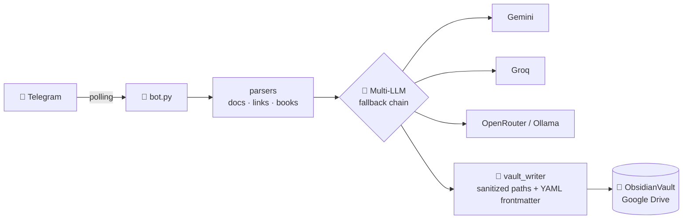

<div align="center">


> **Turn Telegram into your personal knowledge capture pipeline.** Send documents, links, and e-books to a bot — get clean, AI-categorized Markdown notes in your Obsidian vault, synced across all your devices.

[](LICENSE)
[](https://github.com/filmfer/TelegramObsidian/releases)
[](https://www.python.org/)
[](https://www.docker.com/)
[](https://telegram.org/)
[](https://obsidian.md/)
[](#-multi-provider--free)

**Self-hosted** · **Zero exposed ports** · **Free-tier friendly** · **Multi-device sync**

</div>

---

## 🤔 Why?

Your best ideas and readings are scattered across chats, browser tabs and PDFs.
**BrainHarvest** sits in your Telegram and turns *anything* you throw at it into a
clean, categorized, interconnected note in your [Obsidian](https://obsidian.md/) vault —
your personal **second brain**, synced to every device you own.

```
You → Telegram → 🧠 AI → Obsidian Vault → all your devices
```

---

## ✨ Features

### 📥 What you can send

| | Input | What happens |
|---|---|---|
| 📄 | PDF · DOCX · XLSX · TXT · MD · JSON · CSV | Full-text extraction → knowledge note |
| 🔗 | Any web link | 3-layer scraping chain (headers → cloudscraper → jina.ai), SSRF-safe |
| 🎬 | YouTube / video links | 3-tier fallback chain (captions → yt-dlp subtitles → local faster-whisper/Groq audio; up to 1h30+ free) → summary note with video info & thumbnail |
| 📖 | E-books: EPUB · MOBI · AZW·AZW3·AZW4 · DJVU · FB2 · LIT | Title / author / year + multi-page study note with **chapter-by-chapter summaries** and the complete book converted to Markdown, linked from the note |
| 📧 | Email files (`.eml`) | Parsed → knowledge note |
| 💭 | **Plain text thoughts** | Queued safely, then `/text` merges them into one structured, categorized note |
| 🗣️ | Voice notes (`.ogg` / audio files) | Queued, then `/voice` transcribes (free Whisper) into one note · caption `research` = instant deep search |
| 🎥 | Uploaded video files (≤20MB) | ffmpeg extracts audio → Whisper transcript → summary note |

### 🎚️ Detail levels — you control the depth

Send with a caption or `/command`:

| Command | Output |
|---|---|
| `/summarize` | Quick-reference overview |
| `/detailed` ⭐ | **Full study note**: Overview · Key Concepts · Facts & Data · Insights · Open Questions |
| `/precise` | Exact data extraction — every number preserved |
| `/raw` | Verbatim text, metadata only |
| `/book` | Book mode: title, author(s), year + chapter summaries + full-text Markdown (background) |

### ⌨️ Commands

| Command | Action |
|---|---|
| `/text` | Turn every queued text message into **one** note |
| `/voice` | Transcribe every queued audio into **one** note |
| `/queue` | See what's waiting in the queues |
| `/disk` | Check vault disk usage & warnings if space < 20% |
| `/research <topic>` | Deep web research with cited sources |
| `/models` | List working LLM models, tap to switch instantly |
| `/organize preview` | Show which sparse category folders would be merged |
| `/organize` | Propose merges and ask for confirmation before moving anything |
| `/start` · `/help` | Full usage guide |

### 🛡️ Never lose work

- **Duplicate detection** — the same link, file or text sent twice is caught by a local SQLite fingerprint store (URLs are normalized; tracking params stripped; YouTube links collapse to the video id). Add `--force` to any caption/message to override.
- **Queues survive restarts** — `/text` and `/voice` items are persisted in SQLite and expire after `PENDING_QUEUE_TTL_HOURS` (default 24h).
- **Disk-space health alerts** — proactive warning every 6h + inline alerts on notes when free disk space falls below 20% (`DISK_WARN_THRESHOLD_PCT`).
- **10-minute hard cap** — every heavy task is wrapped in a deadline with a "still working" checkpoint; runaway jobs are cancelled and you're told why.
- **Scraper & YouTube resilience** — multi-tier scraper fallback (headers → cloudscraper → jina.ai) and YouTube fallback chain (API → yt-dlp subtitles → local Whisper) handles videos up to 1h30+ for free.
- **Thumbnails** — link & video notes embed the page's `og:image` (or the YouTube thumbnail) at the top, stored in `90_Attachments/thumbnails/`.

### 🗂️ Automatic organization

AI classifies every note into your vault folders:
`Travel` · `Car` · `Finance` · `Programming` · `AI` · `Religion` · `Politics` · `IoT` · `Database` · `Food` · `Books`… — fully customizable.
Books get **multi-label categories** + a *Related Topics* hashtag section, so
the Obsidian graph connects them to every other note on the topic.
`/organize` tidies the vault later: sparse folders are merged into bigger
ones using `config/category_taxonomy.yaml` (protected folders, manual
mappings and a note-count threshold) — always with your confirmation.

### 🔄 Multi-device sync without conflicts

Google Drive keeps your vault available everywhere; a Git repo inside it makes
conflicts *detectable* instead of silently destructive:

| Device | Sync |
|---|---|
| 🖥️ MacBook | Google Drive for Desktop |
| 🖥️ Windows PCs | Google Drive for Desktop |
| 📱 Android | DriveSync / FolderSync |
| 🔁 Versioning | Obsidian Git plugin |

---

## 🏗️ Architecture



**Resilience built in:** if a model is deprecated or down, the fallback chain kicks in,
the bot alerts you on Telegram and offers a live menu of working models — tap to switch.
A weekly health check auto-updates the catalog.

---

## 🚀 Quick Start

### Local (5 minutes)

```bash
cd TelegramAgent/bot
python3 -m venv .venv && source .venv/bin/activate
pip install -r requirements.txt
cp .env.example .env        # add TELEGRAM_BOT_TOKEN + one LLM API key
python bot.py
```

### 🐳 Docker (headless VPS)

```bash
git clone https://github.com/filmfer/TelegramObsidian.git && cd TelegramObsidian/TelegramAgent/bot
cp .env.example .env && nano .env
sudo bash setup_rclone.sh   # mounts your Google Drive vault (headless OAuth)
docker compose up -d --build
```

### ✅ Verify (no API key needed)

```bash
OBSIDIAN_VAULT_PATH=../../ObsidianVault python -m tests.test_pipeline
```

<details>
<summary><b>🔧 Full setup walkthrough</b></summary>

1. **Telegram token** — chat with [@BotFather](https://t.me/BotFather) → `/newbot`
2. **LLM key(s)** — pick any (all have free tiers):
   - [Google AI Studio](https://aistudio.google.com/apikey) → `GEMINI_API_KEY`
   - [Groq Console](https://console.groq.com) → `GROQ_API_KEY` (fastest free tier)
   - [OpenRouter](https://openrouter.ai/keys) → `OPENROUTER_API_KEY` (`:free` models)
3. **Chat ID** — message your bot once, then open `https://api.telegram.org/bot<TOKEN>/getUpdates` and copy `message.chat.id` → `TELEGRAM_CHAT_ID`
4. **Vault path** — point `OBSIDIAN_VAULT_HOST_PATH` at your Drive-mounted folder
5. `docker compose up -d --build` and start sending content!

</details>

---

## 🧠 Multi-Provider & Free 💰

One config, many brains — switch anytime from Telegram with `/models`:

| Provider | Env var | Free tier | Best for |
|---|---|---|---|
| Google Gemini | `GEMINI_API_KEY` | ✅ Flash models, 500+ req/day | default; long context |
| Groq | `GROQ_API_KEY` | ✅ very fast | summaries, audio transcription |
| OpenRouter | `OPENROUTER_API_KEY` | ✅ `:free` models | variety |
| Ollama (local) | `OLLAMA_HOST` | ♾️ unlimited | privacy, offline |

```ini
LLM_MODEL=gemini/gemini-flash-latest          # primary (auto-tracks newest flash)
LLM_FALLBACKS=groq/openai/gpt-oss-120b,gemini/gemini-pro-latest
```

**Never worry about deprecations again:** the bot detects dead models,
auto-switches to the best free alternative, and notifies you — weekly checks included.

---

## 🗺️ Roadmap

- [x] v1.0 — Documents · links · e-books · multi-category vault · Docker deploy
- [x] v1.1 — Multi-provider LLM · `/models` live switching · weekly health checks · text notes · knowledge-note format
- [x] Voice notes → free Whisper transcription (Groq) → notes; caption `research` = deep search
- [x] `/research <topic>` — DuckDuckGo + scrape top sources + cited synthesis
- [x] YouTube/video links → transcript summaries; uploaded videos (≤20MB) → ffmpeg + Whisper
- [x] Scraper fallback chain: browser headers → cloudscraper → jina.ai
- [x] v1.5 — Book notes rebuilt: real chapter detection (EPUB/FB2 TOC, PDF headings) → detailed per-chapter summaries → note assembled locally (no truncation) + complete book saved as Markdown in `90_Attachments/BookTexts/`
- [x] v1.2 — Dedup store (`--force`) · `/text` + `/voice` queues · error handler + 10-min deadlines · thumbnails · `/organize`
- [x] v1.3 — YouTube 3-layer fallback (up to 1h30+ free with yt-dlp & faster-whisper) · Disk-space monitoring (`/disk` + 6h proactive alerts) · Resilient `/organize` · rclone VFS cache auto-heals
- [ ] Semantic search over the vault (`/search <query>`)
- [ ] Photo/screenshot OCR ingestion
- [ ] Weekly review notes

---

## 🔐 Security

Zero-trust by design: no inbound ports (outbound polling only) · SSRF-blocked link fetching
· path-traversal-safe vault writes · XXE-hardened XML parsing · per-user rate limiting ·
non-root container · secrets only via env vars. See the [security table](TelegramAgent/bot/README.md#security).

---

## 👤 Author

**Filipe Fernandes**
📧 filmfer@gmail.com

---

## 📄 License

<details>
<summary><b>Does Telegram need to reach my server?</b></summary>
No. The bot uses outbound long-polling — nothing is exposed to the internet.
</details>

<details>
<summary><b>What does it cost to run?</b></summary>
Oracle Cloud free VPS ($0) + Gemini/Groq free tiers ($0). The bot defaults to
free-tier models with automatic fallback.
</details>

<details>
<summary><b>Can I lose notes from device sync conflicts?</b></summary>
The Git repo inside the vault turns silent Google Drive overwrites into visible,
recoverable Git states.
</details>

---

## 🤝 Contributing

Issues and PRs welcome! Work happens on the `develop` branch — `main` holds the stable release.

## 📄 License

[MIT](LICENSE) © Filipe Fernandes

---

<div align="center">
<sub>Built with ☕ and an unreasonable amount of curiosity.</sub>
</div>

</content>
</invoke>
